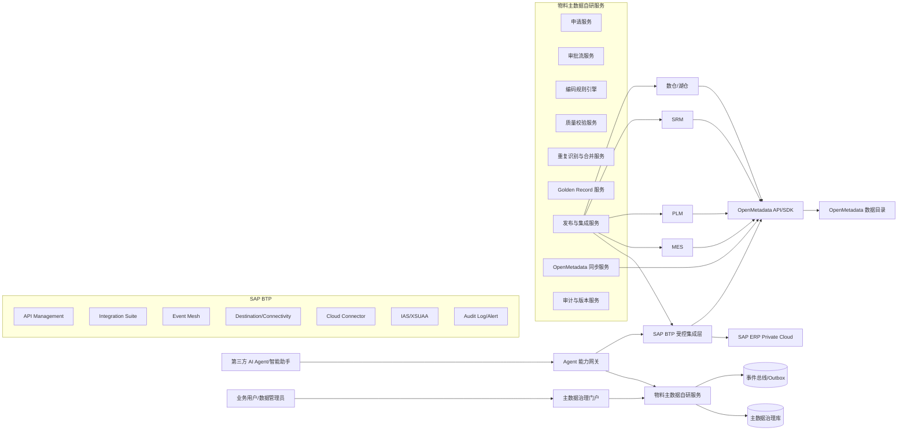
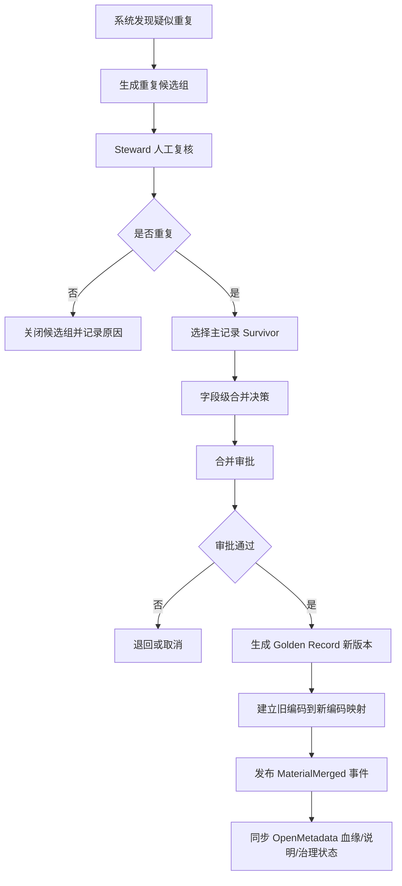
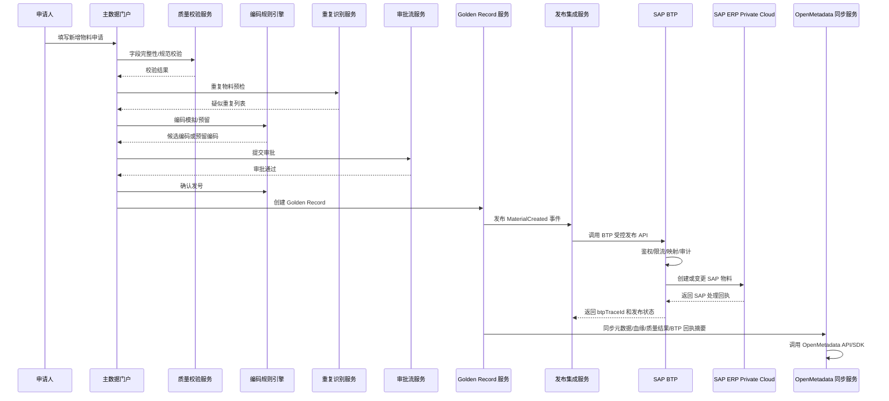
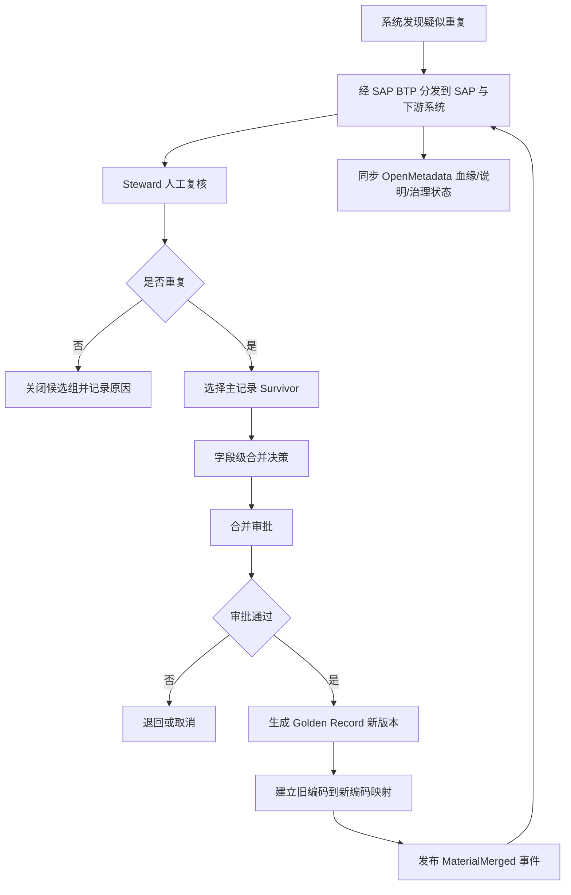

# OpenMetadata + SAP BTP + 自研服务：物料主数据治理架构设计

> **版本**：v1.0  
> **日期**：2026-05-06  
> **定位**：从"能不能部署"进入到"怎么把 OpenMetadata + SAP BTP + 自研服务组合成物料主数据治理平台"的架构设计。  
> **前提**：已确认 OpenMetadata 所有元数据均可通过 REST API/SDK 操作，官方 Python SDK 支持类型化实体读写，认证走 JWT Bearer Token。考虑到 SAP 于 2026 年 4 月公布的第三方 AI Agent 不允许直连 SAP 系统的政策约束，本方案明确：OpenMetadata 与第三方 AI Agent 均不直接连接 SAP 系统；涉及 SAP 的接口访问、事件分发、权限审计和协议适配统一通过 SAP BTP 受控通道完成。

---

## 目录

1. [总体定位](#1-总体定位)
2. [推荐总体架构](#2-推荐总体架构)
3. [自研服务边界与模块](#3-自研服务边界与模块)
4. [核心业务流程](#4-核心业务流程)
5. [推荐 API 设计](#5-推荐-api-设计)
6. [数据模型要点](#6-数据模型要点)
7. [SAP BTP 集成与 OpenMetadata 同步策略](#7-sap-btp-集成与-openmetadata-同步策略)
8. [技术选型建议](#8-技术选型建议)
9. [最小可行版本 MVP](#9-最小可行版本-mvp)
10. [关键设计原则](#10-关键设计原则)
11. [建议实施路线](#11-建议实施路线)

---

## 1. 总体定位

OpenMetadata 适合作为**元数据治理与数据资产可见性平台**，SAP BTP 适合作为**SAP 系统访问、集成、扩展、API 管控和审计的受控通道**，自研服务适合作为**物料主数据交易与治理执行平台**。三者不互相替代，而是分工协作。

| 能力维度 | OpenMetadata 承担 | SAP BTP 承担 | 自研服务承担 |
|---|---|---|---|
| **数据资产目录** | MES/PLM/SRM/数仓、自研主数据服务、BTP 发布 API/事件等资产登记；SAP 资产仅通过 BTP 暴露的受控元数据或离线同步结果登记 | 提供 SAP 侧 API、事件、集成流、连接器和审计日志的受控出口 | 将主数据服务自身的库表/API/事件也登记为治理对象 |
| **业务术语** | 物料、物料组、计量单位、规格型号、品牌、供应商等术语管理 | 可承接 SAP 术语、字段映射和接口语义的集成上下文 | 在申请、校验、审批界面中引用术语标准 |
| **数据血缘** | 展示物料数据从源系统到主数据服务、BTP、数仓、报表、AI 应用的流向；不直接从 SAP 抓取血缘 | 承载 SAP 与外部系统之间的集成流、事件流和 API 调用链路 | 在业务事件发生后推送或补充血缘关系 |
| **数据质量** | 管理质量规则定义、质量结果展示、资产可信度评分 | 可承接 SAP 发布前后的接口校验、错误回执和异常监控 | 执行主数据校验、重复识别、合并决策、质量评分 |
| **Owner/Domain/Tag** | 资产归属、领域、标签、认证状态管理 | 提供 API Product、集成流、Destination、技术用户等集成对象的责任归属 | 将审批责任人、数据 Steward、业务域同步给 OpenMetadata |
| **编码申请/审批** | 不适合承载交易流程 | 可对接 SAP Build Process Automation 或企业 BPM，但不替代主数据业务规则 | 负责完整申请、审批、退回、补正、发布流程 |
| **编码规则引擎** | 不适合做编码生成引擎 | 不做业务编码生成，只做 SAP 接口适配和受控发布 | 负责规则配置、版本、模拟、锁号、发号 |
| **Golden Record** | 可展示 Golden Record 表/API 的元数据 | 承接 Golden Record 到 SAP 的受控发布、回执和事件分发 | 负责黄金记录存储、版本、合并、拆分、发布 |
| **AI Agent 接入** | 展示 Agent 使用的数据资产和治理结果 | 作为 SAP 侧 Agent-ready API 的安全边界，统一认证、授权、限流、审计 | 向 Agent 暴露业务语义能力，不暴露 SAP 原始接口 |

**核心结论**：OpenMetadata 是治理的**观察面**和协作的**目录层**；SAP BTP 是 SAP 访问的**受控集成层**和 AI Agent 的**安全边界**；自研服务是主数据治理的**执行层**和业务的**交易层**。OpenMetadata 与第三方 AI Agent 均不得直连 SAP 系统。

---

## 2. 推荐总体架构



**架构约束**：图中 `BTP --> OM` 表示 OpenMetadata 通过 BTP 暴露的集成元数据、API 台账、事件流、发布回执或同步结果登记 SAP 相关资产和血缘；不表示 OpenMetadata 直接连接 SAP 数据库、SAP 后端接口或 SAP 业务对象 API。

---

## 3. 自研服务边界与模块

### 3.1 申请服务

**职责**：承载物料新增、变更、停用、启用、合并、拆分等申请单全生命周期。

**关键能力**：

- **新增物料申请**：按物料大类、小类、工厂、采购组织、业务场景收集字段。
- **变更申请**：修改规格、描述、计量单位、采购属性、质量属性等。
- **停用/启用申请**：控制状态、原因、影响范围评估。
- **合并申请**：把重复物料合并到目标 Golden Record。
- **拆分申请**：历史误合并后的恢复流程。
- **状态管理**：草稿、提交、撤回、退回补正、作废。

**建议实体**：

| 实体 | 说明 |
|---|---|
| `material_request` | 申请单主表 |
| `material_request_item` | 申请单明细 |
| `material_request_attribute` | 动态字段值（按分类模板扩展） |
| `material_attachment` | 图纸、规格书、供应商资料等附件 |
| `material_comment` | 审批意见和协作评论 |

---

### 3.2 审批流服务

**职责**：把主数据治理制度落到可执行的流程节点上。

**推荐审批模式**：

1. 申请人提交
2. **物料数据 Steward 初审**：字段完整性、命名规范、重复风险扫描
3. **品类 Owner 审核**：业务必要性、分类正确性
4. **工艺/质量/采购/财务按需会签**：不同物料类型触发不同会签节点
5. **主数据管理员终审**：编码发放、Golden Record 发布

**关键能力**：

- 按物料分类、组织、金额、风险等级动态路由
- 支持串行、并行、会签、或签、加签、转办、退回
- 审批 SLA、催办、超时升级
- 审批意见结构化，便于审计和复盘

**是否自研**：

- PoC 阶段可以自研轻量状态机
- 企业落地建议对接现有 BPM/低代码流程平台，例如 Camunda、Flowable、钉钉/企微流程、泛微、蓝凌等

---

### 3.3 编码规则引擎

**职责**：根据业务规则生成、校验、锁定、释放物料编码，保证并发发号唯一。

**典型编码结构**：

```text
[物料大类][物料小类][属性段][流水号][校验位]

示例：RAW-CHEM-000123 或 10.02.000123
```

**核心设计要点**：

| 设计要点 | 说明 |
|---|---|
| **规则版本化** | 同一品类不同时间可使用不同规则 |
| **规则可模拟** | 提交前可预览编码结果 |
| **规则可解释** | 每一段编码都能解释来源 |
| **锁号机制** | 审批中先预留，审批失败释放，审批通过确认 |
| **并发安全** | 编码发放必须用数据库事务或分布式锁保证唯一 |
| **可回溯** | 记录编码生成时使用的规则版本和输入属性 |

**建议实体**：

| 实体 | 说明 |
|---|---|
| `material_code_rule` | 编码规则主表 |
| `material_code_segment` | 编码段定义 |
| `material_code_sequence` | 流水号段 |
| `material_code_reservation` | 编码预留记录 |
| `material_code_history` | 编码生成历史 |

**编码规则示例**：

| 段 | 来源 | 示例 | 说明 |
|---|---|---|---|
| 大类 | 物料分类 | `10` | 原材料 |
| 小类 | 物料小类 | `02` | 化工原料 |
| 属性段 | 关键属性映射 | `A1` | 牌号/规格组合 |
| 流水号 | 按分类递增 | `000123` | 分类内唯一 |
| 校验位 | 算法生成 | `7` | 防输错 |

---

### 3.4 质量校验服务

**职责**：在申请、审批、发布前执行主数据质量规则。

**规则类型**：

| 规则类型 | 示例 |
|---|---|
| **必填性** | 物料名称、分类、基本单位、规格型号不能为空 |
| **唯一性** | 物料编码唯一、关键属性组合唯一 |
| **合法性** | 计量单位必须来自标准字典 |
| **格式性** | 规格型号、图号、物料描述符合模板 |
| **依赖性** | 某类物料必须填写危险品等级、质检批次规则等 |
| **引用完整性** | 供应商、工厂、采购组、税码等必须存在 |
| **语义一致性** | 物料名称与分类、规格、单位不冲突 |

**建议执行点**：

| 时机 | 校验强度 |
|---|---|
| 草稿保存 | 轻校验 |
| 提交申请 | 完整性校验 |
| 审批前 | 重复性和规范性校验 |
| 发布前 | 全量强校验 |
| 发布后 | 周期性质量巡检 |

**与 OpenMetadata 的关系**：

- 自研服务负责实际校验和质量评分
- OpenMetadata 记录质量规则、质量结果、相关数据资产和趋势
- 对物料主数据表、源系统物料表、数仓物料维表配置质量监控，形成治理看板

---

### 3.5 重复识别与合并服务

**职责**：发现疑似重复物料，辅助 Steward 判断并执行合并。

**匹配策略**：

| 策略 | 方法 |
|---|---|
| **精确匹配** | 物料编码、图号、供应商料号、规格型号 |
| **规则匹配** | 名称规范化后相同，单位相同，关键属性相同 |
| **模糊匹配** | 名称相似度、规格相似度、品牌别名、单位换算 |
| **语义匹配** | 基于 Embedding/LLM 判断描述是否指向同一物料 |
| **业务约束** | 不同工厂可共用还是必须分开，是否允许跨组织合并 |

**合并流程**：



**建议实体**：

| 实体 | 说明 |
|---|---|
| `duplicate_candidate_group` | 重复候选组 |
| `duplicate_candidate_pair` | 候选记录两两比较 |
| `merge_case` | 合并案例 |
| `merge_decision` | 字段级合并决策 |
| `material_cross_reference` | 旧编码、新编码、来源系统编码映射 |

---

### 3.6 Golden Record 服务

**职责**：保存企业认可的物料黄金记录，是主数据服务的核心。

**设计原则**：

1. Golden Record 是业务事实，不只是数据库去重结果
2. 每一次变更都产生版本
3. 字段要记录来源、置信度、生效时间、审批单号
4. 支持状态机：草稿、待审批、有效、冻结、停用、废弃
5. 支持跨系统编码映射

**建议核心字段**：

| 字段 | 说明 |
|---|---|
| `material_id` | 内部主键 |
| `material_code` | 企业统一物料编码 |
| `material_name` | 标准物料名称 |
| `material_category` | 物料分类 |
| `base_uom` | 基本计量单位 |
| `specification` | 规格型号 |
| `drawing_no` | 图号 |
| `brand` | 品牌 |
| `manufacturer` | 制造商 |
| `status` | 生命周期状态 |
| `version` | 记录版本 |
| `source_system` | 主要来源系统 |
| `confidence_score` | 置信度 |
| `effective_from` / `effective_to` | 生效区间 |

**附属表**：

| 实体 | 说明 |
|---|---|
| `golden_record_field_source` | 记录每个字段来自哪个系统、哪条记录、何时采集、可信度多少 |
| `material_golden_record_version` | 保存每次变更前后快照和变更原因 |

---

### 3.7 发布与集成服务

**职责**：把通过审批的物料主数据发布到 SAP BTP，再由 BTP 受控分发到 SAP ERP Private Cloud、MES、PLM、SRM、WMS、数仓、AI 应用等系统。涉及 SAP 的创建、变更、查询、停用、事件订阅和回执处理，不允许自研服务、OpenMetadata 或第三方 AI Agent 直连 SAP 系统。

**推荐模式**：

| 模式 | 适用场景 |
|---|---|
| **BTP API 同步** | 需要实时创建或变更 SAP 物料的场景，通过 SAP API Management + Integration Suite 暴露受控 API |
| **BTP 事件分发** | 多个下游系统广播变更，SAP 相关事件优先通过 SAP Event Mesh 或 Integration Suite 分发 |
| **批量文件** | 老系统或接口能力弱的系统 |
| **CDC/Outbox** | 保证数据库变更和事件发布一致 |

**SAP BTP 侧职责**：

| 能力 | 说明 |
|---|---|
| **API Management** | 对 SAP 物料主数据相关 API 做代理、鉴权、限流、配额、版本、订阅和调用分析 |
| **Integration Suite** | 完成协议适配、字段映射、错误处理、重试、路由和集成流编排 |
| **Event Mesh** | 承接物料创建、变更、停用、合并等事件的异步分发 |
| **Destination / Connectivity / Cloud Connector** | 管理 BTP 到 SAP Private Cloud 或内网系统的连接路径 |
| **IAS / XSUAA** | 管理身份认证、OAuth Scope、技术用户和委托访问策略 |
| **Audit Log / Alert Notification** | 记录 SAP 相关接口调用、异常访问、失败回执和告警 |

**建议事件类型**：

- `MaterialCreated`
- `MaterialChanged`
- `MaterialDeactivated`
- `MaterialMerged`
- `MaterialCodeReserved`
- `MaterialCodeReleased`
- `GoldenRecordPublished`

**事件内容示例**：

```json
{
  "eventId": "uuid",
  "eventType": "MaterialCreated",
  "occurredAt": "2026-05-06T10:30:00+08:00",
  "materialCode": "10.02.000123",
  "sapMaterialNo": "000000000000100123",
  "goldenRecordId": "uuid",
  "version": 3,
  "requestId": "REQ-20260506-0001",
  "changedFields": ["materialName", "baseUom", "specification"],
  "btpTraceId": "uuid",
  "traceId": "uuid"
}
```

---

### 3.8 OpenMetadata 同步服务

**职责**：把主数据治理过程产生的元数据、质量结果、血缘、责任人、标签同步到 OpenMetadata。对于 SAP 相关资产，OpenMetadata 不直接连接 SAP 系统，而是通过 SAP BTP 提供的 API 台账、集成流、事件流、发布回执、审计日志摘要或经授权的同步结果登记 SAP 相关元数据和血缘。

**OpenMetadata 官方能力基础**：

- OpenMetadata API 提供对元数据目录的程序化访问
- API 请求使用 JWT Bearer Token
- 官方 Python SDK 是 `openmetadata-ingestion` 包的一部分，要求 SDK 版本与 OpenMetadata Server 版本一致
- SDK 支持类型化实体操作，例如 DatabaseService、Database、Schema、Table、Users 等
- 可通过 Bot Token 或 Personal Access Token 作为自研服务的调用凭证

**建议同步内容**：

| 自研服务对象 | 同步到 OpenMetadata 的方式 |
|---|---|
| 主数据治理库表 | 通过数据库连接器采集为 Table 资产 |
| 物料 Golden Record 表 | 登记为核心数据资产，绑定 Owner、Domain、Glossary Term |
| 编码规则表 | 登记为治理配置资产，可加自定义标签或说明 |
| 申请/审批表 | 登记为治理流程数据资产，用于审计可见性 |
| 质量结果表 | 作为质量规则输出表或指标资产 |
| BTP API Product / API Proxy | 登记为受控 SAP 访问 API 资产，记录 Owner、Scope、调用方和版本 |
| BTP Integration Flow | 登记为 SAP 与主数据服务、MES、PLM、SRM、数仓之间的集成资产 |
| BTP Event Mesh Topic | 登记为主数据事件分发资产，关联事件生产方和消费方 |
| 物料术语 | 同步到 Glossary / Glossary Term |
| 物料分类 | 同步为 Glossary 层级或 Classification Tag |
| 数据 Owner | 同步为 User/Team/Owner 关系 |
| SAP 受控接口到 Golden Record | 通过 BTP 集成元数据同步为 Lineage，不直连 SAP |
| Golden Record 到 SAP/MES/数仓/报表/API | 通过发布事件、BTP 回执和下游同步结果同步为 Lineage |

**重要边界**：

- **不要把每一个物料编码都建成 OpenMetadata 的独立实体**。物料记录可能几十万到千万级，OpenMetadata 更适合管理"资产"和"字段"，不适合替代主数据记录库。
- 建议把物料 Golden Record 表、字段、API、数据产品、报表、质量规则作为 OpenMetadata 资产；具体每条物料记录仍保存在自研主数据服务中。
- **不要让 OpenMetadata 直接连接 SAP 系统**。SAP 相关表、接口、事件、回执和血缘只通过 BTP 受控通道、离线台账或授权同步结果进入 OpenMetadata。
- **不要把第三方 AI Agent 作为 SAP 接口调用方**。Agent 只能调用自研服务或 BTP 暴露的业务语义 API，并受最小权限、工具白名单、人工确认和审计约束。

---

### 3.9 审计与版本服务

**职责**：保证主数据全生命周期可追溯。

**必须记录的内容**：

- 谁提交了申请
- 谁审批、退回、加签、驳回
- 哪些字段变化了（变更前后值）
- 编码规则哪个版本生成了编码
- 重复识别为什么判定相似
- 合并时哪些字段来自哪条源记录
- Golden Record 每个版本何时生效
- 何时同步给哪些系统，是否成功
- 何时通过 SAP BTP 调用 SAP，调用方、Scope、traceId、btpTraceId、回执和失败原因是什么
- 何时同步到 OpenMetadata，是否成功

---

## 4. 核心业务流程

### 4.1 新增物料编码申请流程



**关键约束**：该流程中 OpenMetadata 只接收自研服务和 BTP 产生的元数据、血缘、质量结果和回执摘要，不直接访问 SAP；第三方 AI Agent 如需辅助填单、查询相似物料或解释规则，只能调用 Agent 能力网关或业务语义 API，不能直连 SAP。

### 4.2 合并重复物料流程



---

## 5. 推荐 API 设计

### 5.1 申请 API

```http
POST   /api/material-requests
GET    /api/material-requests/{requestId}
POST   /api/material-requests/{requestId}/submit
POST   /api/material-requests/{requestId}/withdraw
POST   /api/material-requests/{requestId}/cancel
```

### 5.2 审批 API

```http
POST   /api/workflow/tasks/{taskId}/approve
POST   /api/workflow/tasks/{taskId}/reject
POST   /api/workflow/tasks/{taskId}/return
POST   /api/workflow/tasks/{taskId}/delegate
GET    /api/workflow/tasks?assignee={userId}
```

### 5.3 编码规则 API

```http
POST   /api/code-rules
PUT    /api/code-rules/{ruleId}
POST   /api/code-rules/{ruleId}/simulate
POST   /api/material-codes/reserve
POST   /api/material-codes/{reservationId}/confirm
POST   /api/material-codes/{reservationId}/release
```

### 5.4 Golden Record API

```http
GET    /api/materials/{materialCode}
POST   /api/materials
PUT    /api/materials/{materialCode}
GET    /api/materials/{materialCode}/versions
GET    /api/materials/{materialCode}/field-sources
POST   /api/materials/{materialCode}/deactivate
```

### 5.5 重复识别与合并 API

```http
POST   /api/duplicate-checks
GET    /api/duplicate-groups/{groupId}
POST   /api/merge-cases
POST   /api/merge-cases/{caseId}/decisions
POST   /api/merge-cases/{caseId}/submit
POST   /api/merge-cases/{caseId}/execute
```

### 5.6 OpenMetadata 同步 API

```http
POST   /api/openmetadata/sync/assets
POST   /api/openmetadata/sync/glossary
POST   /api/openmetadata/sync/lineage
POST   /api/openmetadata/sync/quality-results
GET    /api/openmetadata/sync-jobs/{jobId}
POST   /api/openmetadata/sync-jobs/{jobId}/retry
```

### 5.7 SAP BTP 集成 API

```http
POST   /api/btp/materials/publish
POST   /api/btp/materials/{materialCode}/change
POST   /api/btp/materials/{materialCode}/deactivate
GET    /api/btp/publish-jobs/{jobId}
POST   /api/btp/publish-jobs/{jobId}/retry
GET    /api/btp/integration-traces/{btpTraceId}
```

### 5.8 Agent 受控能力 API

```http
POST   /api/agent/materials/search-similar
POST   /api/agent/materials/recommend-category
POST   /api/agent/materials/recommend-attributes
POST   /api/agent/material-requests/draft
GET    /api/agent/tool-calls/{traceId}
```

**Agent API 边界**：上述接口只返回业务语义结果和受权限裁剪后的数据，不返回 SAP 原始接口地址、SAP 技术用户凭证、SAP 后端表结构或超出当前用户授权范围的数据。

---

## 6. 数据模型要点

### 6.1 核心实体关系

```text
material_request (1)
  ├── material_request_item (N)
  │     └── material_request_attribute (N)
  ├── material_attachment (N)
  └── material_comment (N)

material_golden_record (1)
  ├── golden_record_field_source (N)
  ├── material_golden_record_version (N)
  └── material_cross_reference (N)

material_code_rule (1)
  ├── material_code_segment (N)
  └── material_code_sequence (N)

material_code_reservation (N) --> material_code_history (N)

duplicate_candidate_group (1)
  ├── duplicate_candidate_pair (N)
  └── merge_case (1)
        └── merge_decision (N)
```

### 6.2 关键设计约束

| 约束 | 说明 |
|---|---|
| 申请单与 Golden Record 分离 | 申请单是流程载体，Golden Record 是结果载体，不要混用 |
| 编码预留独立表 | 预留和最终确认必须分开，支持并发和回滚 |
| 字段级来源表 | 每个 Golden Record 字段都要能解释来源和可信度 |
| 版本表只增不删 | 历史版本用于审计和回溯，不允许物理删除 |
| 跨引用表维护映射 | 旧编码、新编码、各系统编码必须可追溯 |

---

## 7. SAP BTP 集成与 OpenMetadata 同步策略

### 7.1 总体原则

| 原则 | 说明 |
|---|---|
| **SAP 访问经 BTP** | 涉及 SAP 的接口调用、事件订阅、回执处理、审计日志均通过 SAP BTP，OpenMetadata 和第三方 AI Agent 不直连 SAP |
| **OpenMetadata 异步化** | OpenMetadata 同步失败不能阻塞主数据审批发布流程 |
| **最终一致** | 允许秒级到分钟级的延迟，通过重试保证最终一致 |
| **幂等设计** | 同步操作要支持重复执行不产生副作用 |
| **批量优先** | 避免逐条调用 OpenMetadata API，尽量批量推送 |
| **最小权限** | BTP API、Agent 工具、OpenMetadata Bot Token 均按最小权限授权 |
| **全链路审计** | 申请单号、materialCode、traceId、btpTraceId、OpenMetadata syncJobId 必须能串联追踪 |

### 7.2 BTP 集成策略

| 集成对象 | 推荐策略 |
|---|---|
| SAP 物料创建/变更 | 自研服务调用 BTP API Proxy；BTP Integration Suite 转换为 SAP OData/BAPI/RFC/IDoc 等实际接口 |
| SAP 查询 | 只暴露业务语义查询 API，禁止 Agent 或 OpenMetadata 直接查询 SAP 原始对象 |
| SAP 事件 | 通过 Event Mesh 或 Integration Suite 将 SAP/主数据事件分发给下游系统 |
| SAP 回执 | BTP 将成功、失败、错误码、业务消息、btpTraceId 回传自研服务 |
| 接口权限 | API Product + OAuth Scope + 技术用户最小权限 + 必要时 Principal Propagation |
| 异常处理 | BTP 侧记录集成错误，自研服务侧记录发布任务状态并支持重试、补偿和人工修复 |

### 7.3 OpenMetadata 同步时机

| 触发时机 | 同步内容 |
|---|---|
| 物料分类/模板变更 | 同步到 Glossary、Classification |
| Golden Record 创建/变更 | 同步表资产元数据、Owner、Tag |
| 质量规则执行完成 | 同步质量结果到 OpenMetadata TestCase |
| BTP API/集成流变更 | 同步 API Product、API Proxy、Integration Flow、Event Topic 等集成资产 |
| SAP 发布完成 | 通过 BTP 回执摘要同步血缘关系、发布状态、治理状态 |
| 审批流程完成 | 同步血缘关系、治理状态 |
| 周期性任务 | 全量对齐资产目录、术语、Owner、BTP 集成台账 |

### 7.4 冲突处理

- 以自研服务为**主数据源**，OpenMetadata 为**只读展示层**
- 以 SAP BTP 为**SAP 访问事实来源**，SAP 相关接口调用状态以 BTP 回执和审计摘要为准
- 若 OpenMetadata 中资产被人工修改，同步时根据策略覆盖或告警
- 建议对关键同步配置"覆盖模式"或"合并模式"
- 若 BTP 台账、OpenMetadata 资产和自研服务发布记录不一致，应生成对账任务，由集成管理员和数据治理管理员确认

---

## 8. 技术选型建议

### 8.1 PoC 技术栈

| 层 | 选型 | 理由 |
|---|---|---|
| 后端框架 | Python FastAPI 或 Java Spring Boot | FastAPI 开发快，Spring Boot 企业兼容性好 |
| 数据库 | PostgreSQL | 与 OpenMetadata 默认栈一致，支持 JSONB 和 trigram |
| 工作流 | 轻量状态机 / Camunda / Flowable | PoC 先轻量，落地再对接企业 BPM |
| 消息 | PostgreSQL Outbox | 起步简单，后续可接 Kafka/RabbitMQ |
| 规则引擎 | 数据库配置 + 表达式引擎 | 复杂后再引入 Drools 或自研 DSL |
| 重复识别 | PostgreSQL trigram / Python 相似度算法 | PoC 阶段够用 |
| SAP BTP 集成 | API Management + Integration Suite 试用/测试租户 | 验证 SAP 受控发布路径和第三方 Agent 不直连 SAP 的边界 |
| OpenMetadata 集成 | Python SDK 优先 | 复杂 PATCH 或特殊实体用 REST API 补充 |

### 8.2 企业落地技术栈

| 层 | 选型 |
|---|---|
| 后端 | Java Spring Boot（更适合企业系统集成、事务、流程、权限） |
| 数据库 | PostgreSQL / Oracle / MySQL，取决于企业标准 |
| 搜索 | Elasticsearch / OpenSearch，用于物料检索与相似匹配 |
| 消息 | Kafka，用于主数据事件分发 |
| SAP BTP | Integration Suite、API Management、Event Mesh、Destination、Connectivity、Cloud Connector、IAS/XSUAA、Audit Log |
| 工作流 | Camunda 8、Flowable 或企业现有 BPM |
| 权限 | 企业 SSO / OIDC / LDAP |
| 审计 | 独立审计表 + 日志平台 |
| 观测 | Prometheus/Grafana + ELK/OpenSearch |

---

## 9. 最小可行版本 MVP

### 9.1 第一阶段八大能力

不要一口气做完整 MDM，建议先实现以下 8 个能力：

1. **物料新增申请**：完整的申请单填写、保存、提交
2. **物料分类与字段模板**：支持按分类动态扩展字段
3. **基础编码规则引擎**：支持分段规则、模拟、预留、确认
4. **重复物料预检**：至少一类匹配策略（精确或模糊）
5. **两级审批**：Steward 初审 + Owner 终审
6. **Golden Record 表和版本记录**：保存审批通过后的黄金记录
7. **BTP 受控发布**：至少通过 BTP 模拟发布到 SAP 或 SAP Mock 服务，记录 btpTraceId 和回执
8. **OpenMetadata 同步**：同步 Golden Record 表、术语、Owner、血缘、BTP API/集成资产和发布状态

### 9.2 MVP 成功标准

- [ ] 能从申请生成一条**可追溯**的物料 Golden Record
- [ ] 能**解释编码**为什么这样生成（规则版本、输入属性）
- [ ] 能**发现至少一类**重复物料并给出候选
- [ ] 能保留**审批和版本审计**
- [ ] 能通过 SAP BTP 完成 SAP 受控发布或模拟发布，且 OpenMetadata 不直连 SAP
- [ ] 能在 OpenMetadata 中看到主数据表、字段、Owner、术语、血缘、质量结果和 BTP 集成资产

---

## 10. 关键设计原则

1. **OpenMetadata 不做交易主库**：它展示和治理资产，自研服务保存每条物料记录
2. **OpenMetadata 不直连 SAP**：SAP 相关资产、血缘、质量和回执通过 BTP 台账、事件、API 摘要或授权同步结果进入 OpenMetadata
3. **第三方 AI Agent 不直连 SAP**：Agent 只能调用业务语义 API 或 Agent 能力网关，所有 SAP 侧能力必须经 BTP 受控通道
4. **SAP 访问必须走 BTP 治理面**：API Management、Integration Suite、Event Mesh、Destination、Cloud Connector、IAS/XSUAA、Audit Log 构成 SAP 接口访问边界
5. **先建标准，再建流程**：物料分类、字段模板、编码规则、术语表必须先定，否则审批会变成人肉纠错
6. **编码发放必须事务化**：并发场景不能靠前端生成编码，必须用数据库事务或分布式锁
7. **Golden Record 要字段级溯源**：每个字段记录来源系统、来源记录、采集时间、可信度，否则后续合并、纠错、审计会很困难
8. **重复识别要人机协同**：算法给候选，Steward 做最终判定，不要全自动合并
9. **对外发布用事件驱动**：比点对点接口更适合多系统集成，降低耦合
10. **同步 OpenMetadata 要异步化**：不要让 OpenMetadata 同步失败阻塞主数据审批发布
11. **所有治理动作要审计**：主数据治理的核心价值之一就是可追责、可解释、可复盘

---

## 11. 建议实施路线

### 第 1 周：概念验证

- [ ] 部署 OpenMetadata 本地 PoC（Docker Desktop + WSL2 + PostgreSQL）
- [ ] 开通或确认 SAP BTP 测试租户，至少准备 API Management、Integration Suite、Destination/Connectivity 能力
- [ ] 建 PostgreSQL 物料主数据样例库
- [ ] 建最小申请单、编码规则、Golden Record 表
- [ ] 用脚本或 API 把物料表同步到 OpenMetadata，验证 API/SDK 能力
- [ ] 建立 SAP Mock 或 SAP 测试接口代理，验证 OpenMetadata 不直连 SAP、发布路径经 BTP

### 第 2-3 周：流程 MVP

- [ ] 实现新增申请、审批、编码预留、编码确认
- [ ] 实现 Golden Record 版本记录
- [ ] 实现重复物料预检（至少一种策略）
- [ ] 实现 BTP 受控发布、回执记录、btpTraceId 追踪和失败重试
- [ ] 实现 OpenMetadata 术语、Owner、标签、血缘同步
- [ ] 跑通端到端：申请 -> 审批 -> 编码 -> Golden Record -> BTP 发布 -> SAP Mock/测试环境 -> OpenMetadata 同步

### 第 4-6 周：业务增强

- [ ] 增加变更、停用、合并流程
- [ ] 增加质量规则配置和结果回写
- [ ] 增加通过 SAP BTP 发布到 SAP ERP Private Cloud、MES、数仓的适配器
- [ ] 增加审计报表和治理看板
- [ ] 增加重复识别算法（模糊匹配 + 语义匹配）
- [ ] 增加第三方 AI Agent 受控能力网关，确保 Agent 不直连 SAP

### 第 7 周以后：生产化

- [ ] 接入 SSO、权限、企业 BPM
- [ ] 接入 SAP BTP IAS/XSUAA、Audit Log、Alert Notification、Cloud Connector 生产配置
- [ ] 镜像私有化、配置密钥化、日志监控
- [ ] 数据备份、灾备、发布重试、幂等机制
- [ ] 扩展到客户、供应商、BOM、设备等其他主数据域
- [ ] 性能优化：分库分表、缓存、搜索优化
- [ ] 定期对账 SAP BTP API 台账、OpenMetadata 资产目录和自研服务发布记录，确认不存在第三方直连 SAP 路径

---

## 附录：相关文档

- [OpenMetadata 本地部署可行性研究](./OpenMetadata_本地部署可行性研究.md)
- OpenMetadata 官方文档：https://docs.open-metadata.org/
- OpenMetadata Python SDK：`openmetadata-ingestion`
- OpenMetadata API 认证：JWT Bearer Token / Bot Token / Personal Access Token
