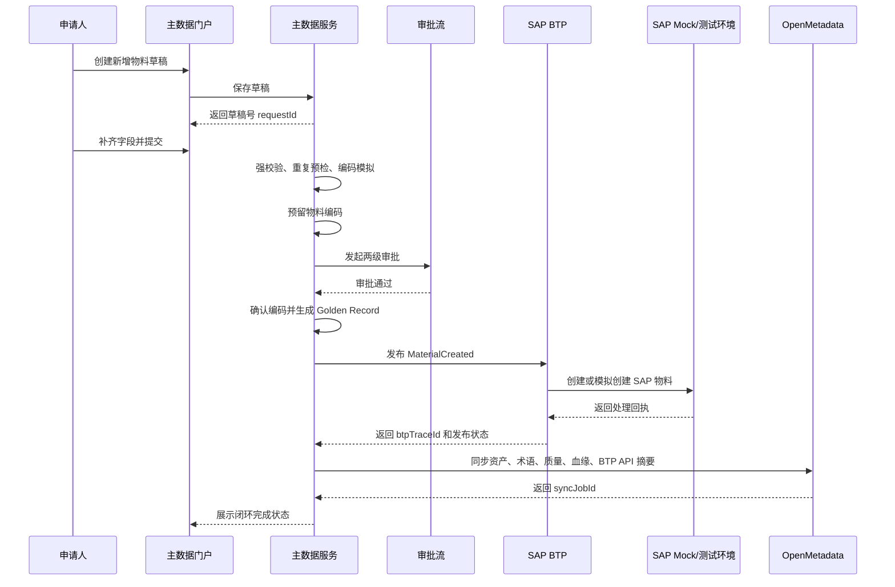

# 基于 Ralph Loop 的物料主数据治理 PRD

> 版本：v0.1  
> 日期：2026-05-06  
> 依据：[OpenMetadata_物料主数据自研服务集成设计.md](OpenMetadata_物料主数据自研服务集成设计.md)  
> 方法论：Ralph Loop，强调线性演练、最小可验证闭环、小步交付、上下文外置、真实验证和收敛迭代。

---

## 1. 产品定型

### 1.1 产品名称

OpenMetadata + SAP BTP + 自研服务的物料主数据治理平台。

### 1.2 产品类型

B 端主数据治理与集成管控平台，面向制造业物料主数据新增、变更、停用、重复识别、编码规则、Golden Record、SAP BTP 受控发布、OpenMetadata 治理可见性和 AI Agent 安全接入。

### 1.3 Ralph Loop 定型结论

本产品不先追求一次性建设完整 MDM，而先交付一条能被业务、IT、集成、治理和审计共同验证的最小闭环：

```text
配置物料分类模板
  -> 创建新增物料申请
  -> 质量校验与重复预检
  -> 编码模拟与预留
  -> Steward/Owner 两级审批
  -> 生成 Golden Record
  -> 经 SAP BTP 受控发布到 SAP Mock 或 SAP 测试环境
  -> 回写发布回执与 btpTraceId
  -> 同步资产、血缘、质量结果到 OpenMetadata
  -> 在审计视图中串联 requestId、materialCode、traceId、btpTraceId、openmetadataSyncJobId
```

每个后续能力都必须挂接到这条闭环上，而不是单独建设“看起来完整但无法端到端演示”的横向模块。

### 1.4 产品边界

| 系统 | 定位 | 明确不做 |
|---|---|---|
| OpenMetadata | 数据资产目录、术语、Owner、血缘、质量结果和治理协作观察面 | 不直连 SAP，不保存每条物料主数据交易记录，不承载审批交易 |
| SAP BTP | SAP 访问受控集成层、API 管控、事件分发、权限审计、Agent 安全边界 | 不做业务编码生成，不替代主数据治理规则 |
| 自研服务 | 申请、审批、编码、质量、重复识别、Golden Record、发布编排、审计 | 不绕过 BTP 直连 SAP，不把 OpenMetadata 当交易主库 |
| 第三方 AI Agent | 辅助填单、查询相似物料、推荐分类、解释规则 | 不直连 SAP，不持有 SAP 凭证，不执行无人工确认的写入动作 |

---

## 2. 背景与问题

### 2.1 业务背景

企业存在 SAP ERP Private Cloud、MES、PLM、SRM、WMS、数仓/湖仓和 AI 应用等多系统协同场景。物料主数据是采购、生产、质量、财务、库存和报表的基础对象。若入口、编码、分类、单位、规格、发布路径和责任人不统一，将造成重复物料、跨系统不一致、审批不可追溯、SAP 接口访问不合规和 AI Agent 越权风险。

### 2.2 政策与架构约束

考虑到 SAP 于 2026 年 4 月公布的第三方 AI Agent 不允许直连 SAP 系统的政策约束，本产品必须满足：

1. OpenMetadata 不直接连接 SAP 系统。
2. 第三方 AI Agent 不直接连接 SAP 系统。
3. 涉及 SAP 的接口访问、事件分发、回执处理、权限审计和协议适配统一通过 SAP BTP 完成。
4. 所有 SAP 写入必须能追溯到业务申请单、审批记录、调用身份、Scope、traceId、btpTraceId 和发布回执。
5. OpenMetadata 只登记 BTP 暴露的集成元数据、API 台账、事件流、发布回执摘要和授权同步结果。

### 2.3 当前痛点

| 编号 | 痛点 | 影响 |
|---|---|---|
| P1 | 物料新增入口不统一 | 重复申请、字段缺失、审批反复退回 |
| P2 | 物料编码规则不透明 | 发号冲突、编码不可解释、历史不可追溯 |
| P3 | 重复物料识别不足 | 重复采购、库存积压、报表失真 |
| P4 | SAP 接口访问缺少治理面 | 第三方直连、审计缺口、许可与合规风险 |
| P5 | OpenMetadata 与交易流程脱节 | 只能看到资产，无法看到治理动作和质量状态 |
| P6 | AI Agent 接入边界不清 | 可能越权查询 SAP 或触发未经确认的写入动作 |
| P7 | 系统发布结果不可串联追踪 | 申请、编码、SAP 回执、OpenMetadata 血缘难以关联 |

---

## 3. 目标与指标

### 3.1 产品目标

1. 用最小闭环跑通物料新增治理流程。
2. 用 SAP BTP 替代任何第三方对 SAP 的直连路径。
3. 用 Golden Record 建立物料主数据治理事实。
4. 用 OpenMetadata 展示主数据表、术语、Owner、质量、血缘和 BTP 集成资产。
5. 用受控 Agent API 支持智能填单和相似物料推荐，同时确保 Agent 不直连 SAP。
6. 用全链路审计串联业务、数据、集成和治理动作。

### 3.2 成功指标

| 指标 | 口径 | MVP 目标 | 采集方式 |
|---|---|---:|---|
| 端到端闭环成功率 | 新增申请到 OpenMetadata 同步成功的案例占比 | 90% 以上 | 申请单、发布任务、同步任务日志 |
| SAP 直连违规数 | 非 BTP 路径访问 SAP 的系统或 Agent 数 | 0 | 接口台账、安全审计 |
| 编码可解释率 | 可展示规则版本、输入属性、预留记录的编码占比 | 100% | 编码历史表 |
| 发布可追溯率 | 有 requestId、materialCode、traceId、btpTraceId 的发布占比 | 100% | 发布事件、BTP 回执 |
| 重复预检覆盖率 | 提交前执行重复预检的申请占比 | 100% | 重复检查日志 |
| OpenMetadata 可见性 | Golden Record 表、术语、Owner、血缘、质量、BTP API 资产是否可见 | MVP 必达 | OpenMetadata 页面验收 |
| Agent 安全留痕率 | Agent 工具调用有用户、工具、输入摘要、输出摘要、traceId 的占比 | 100% | Agent 调用审计 |

---

## 4. 用户与角色

| 角色 | 需求 | 关键操作 |
|---|---|---|
| 申请人 | 快速提交物料新增申请，知道缺什么、是否重复、进度如何 | 建草稿、补字段、提交、查看进度 |
| 物料数据 Steward | 确认字段完整、命名规范、重复风险可控 | 初审、退回、确认重复预检结果 |
| 品类 Owner | 判断物料分类和业务必要性 | 审批、驳回、确认分类 |
| 主数据管理员 | 维护编码规则，确认发号与发布 | 配规则、确认编码、发布、修复失败 |
| SAP 集成管理员 | 保证所有 SAP 调用经 BTP 受控 | 配 API Proxy、Integration Flow、Destination、Scope、告警 |
| 数据治理管理员 | 在 OpenMetadata 中管理资产、术语、Owner、血缘、质量 | 查看和维护资产目录、同步任务、质量结果 |
| AI Agent 使用者 | 通过智能助手辅助填单和查询相似物料 | 请求推荐、生成草稿、解释规则 |
| 审计/合规人员 | 追溯谁因何访问或修改物料主数据 | 查申请链、审批链、发布链、Agent 调用链 |

---

## 5. 范围与边界

### 5.1 MVP 范围

MVP 只做“新增物料”这一条 tracer bullet，不同时铺开变更、停用、合并、拆分和多主数据域。

MVP 包含：

1. 物料分类和字段模板配置。
2. 新增物料申请草稿、保存、提交。
3. 草稿轻校验、提交强校验。
4. 重复物料预检，至少支持精确匹配和基础模糊匹配。
5. 编码规则配置、模拟、预留、确认、释放。
6. Steward 初审、Owner 终审。
7. Golden Record 创建与版本 1 快照。
8. Outbox 发布事件。
9. SAP BTP 受控发布到 SAP Mock 或 SAP 测试环境。
10. BTP 回执、btpTraceId、错误重试。
11. OpenMetadata 同步 Golden Record 表、术语、Owner、质量结果、BTP API 资产、血缘摘要。
12. Agent 受控辅助填单的最小能力：相似物料查询、分类推荐、属性建议、草稿生成。
13. 审计视图：按 requestId 串联审批、编码、发布、BTP 回执、OpenMetadata 同步和 Agent 调用。

### 5.2 非 MVP 范围

1. 变更、停用、启用、合并、拆分完整流程。
2. SAP 生产环境写入。
3. 自动审批或 Agent 代审批。
4. 全量 SAP 资产扫描。
5. OpenMetadata 直接采集 SAP 表或 SAP 后端接口。
6. 复杂语义去重、LLM 自动合并。
7. 客户、供应商、BOM、设备等其他主数据域。

### 5.3 Ralph Loop 范围控制规则

- 每个 US 必须能被单独演示，不以“后端完成但看不到结果”为完成标准。
- 每个 US 必须有失败路径和审计记录，尤其是 BTP 发布与 OpenMetadata 同步。
- 每个 US 尽量只改变一个业务事实，避免“一个故事交付一个模块”。
- 每一轮只扩展一个闭环节点，先让链路变长，再让节点变厚。
- 若某功能不能接入端到端闭环，应降级为后续增强。

---

## 6. 端到端用户流程

### 6.1 MVP 主流程



### 6.2 关键异常流程

| 异常 | 系统行为 | 用户可见结果 | 是否阻塞主流程 |
|---|---|---|---|
| 草稿字段缺失 | 允许保存，不允许提交 | 字段级错误提示 | 阻塞提交 |
| 提交强校验失败 | 不生成编码预留 | 展示规则、字段和值 | 阻塞审批 |
| 发现疑似重复 | 生成重复候选列表 | 要求申请人说明是否复用或继续申请 | 可配置是否阻塞 |
| 编码预留冲突 | 重新获取序列或提示重试 | 显示编码预留失败原因 | 阻塞提交 |
| Steward 退回 | 申请状态改为退回补正 | 申请人补充后再提交 | 阻塞审批 |
| BTP 发布失败 | Golden Record 保留，发布任务失败待重试 | 显示 btpTraceId、错误摘要、重试入口 | 不删除 Golden Record，但状态为发布失败 |
| OpenMetadata 同步失败 | 进入同步失败队列 | 显示 syncJobId 和重试入口 | 不阻塞 SAP 发布 |
| Agent 越权请求 | 拦截并记录审计 | 返回无权限或需人工确认 | 阻塞工具调用 |

---

## 7. 功能需求

### 7.1 分类与字段模板

| 编号 | 需求 | 验收 |
|---|---|---|
| FR-TPL-001 | 管理员可配置物料大类、小类、字段模板和必填规则 | 选择分类后表单动态展示字段，必填规则生效 |
| FR-TPL-002 | 模板字段支持类型、枚举、默认值、示例和说明 | 申请人可看到字段说明，枚举值来自标准字典 |
| FR-TPL-003 | 模板变更可触发 OpenMetadata 术语同步任务 | 同步任务可见，失败可重试 |

### 7.2 新增申请

| 编号 | 需求 | 验收 |
|---|---|---|
| FR-REQ-001 | 申请人可创建新增物料草稿 | 返回 requestId，状态为草稿 |
| FR-REQ-002 | 草稿保存执行轻校验 | 缺少必填项时可保存但标记待补齐 |
| FR-REQ-003 | 提交执行强校验 | 必填、枚举、格式、依赖、引用规则全部通过才可提交 |
| FR-REQ-004 | 提交后生成审计记录 | 审计记录包含提交人、时间、字段摘要和 traceId |

### 7.3 质量校验

| 编号 | 需求 | 验收 |
|---|---|---|
| FR-DQ-001 | 支持必填、格式、枚举、依赖和引用完整性校验 | 每条失败规则返回字段、规则、当前值、修复建议 |
| FR-DQ-002 | 质量结果可记录到申请单和质量结果表 | 可按 requestId 查看全部校验结果 |
| FR-DQ-003 | 质量结果可同步到 OpenMetadata | OpenMetadata 可看到质量规则或质量结果资产 |

### 7.4 重复预检

| 编号 | 需求 | 验收 |
|---|---|---|
| FR-DUP-001 | 提交前自动执行重复预检 | 每次提交都有 duplicateCheckId |
| FR-DUP-002 | 支持精确匹配 | 图号、供应商料号、规格型号完全一致时提示高风险 |
| FR-DUP-003 | 支持基础模糊匹配 | 名称规范化和规格相似度返回候选分数 |
| FR-DUP-004 | Steward 可确认候选处理结果 | 结果为复用、继续申请、退回补正或转合并候选 |

### 7.5 编码规则

| 编号 | 需求 | 验收 |
|---|---|---|
| FR-CODE-001 | 管理员可配置分段编码规则 | 支持分类段、属性段、流水号、校验位 |
| FR-CODE-002 | 申请提交时可模拟编码 | 展示每段编码的来源和规则版本 |
| FR-CODE-003 | 审批中预留编码 | 预留记录包含 reservationId、materialCode、ruleVersion |
| FR-CODE-004 | 审批通过后确认编码 | 编码状态从 reserved 变为 confirmed |
| FR-CODE-005 | 审批驳回或取消时释放编码 | 编码状态从 reserved 变为 released |

### 7.6 审批流

| 编号 | 需求 | 验收 |
|---|---|---|
| FR-WF-001 | 默认两级审批 | Steward 初审通过后进入 Owner 终审 |
| FR-WF-002 | 审批人可通过、驳回、退回补正 | 状态流转正确，意见必填 |
| FR-WF-003 | 审批动作全量留痕 | 可看到审批人、节点、动作、意见、时间 |
| FR-WF-004 | 审批通过触发 Golden Record 创建 | 只在终审通过后创建 Golden Record |

### 7.7 Golden Record

| 编号 | 需求 | 验收 |
|---|---|---|
| FR-GR-001 | 审批通过后创建 Golden Record | 记录 materialCode、名称、分类、单位、规格、版本 |
| FR-GR-002 | 记录字段级来源 | 每个关键字段包含来源、可信度、审批单号 |
| FR-GR-003 | 保存版本快照 | 版本 1 可回看，后续变更不覆盖历史 |
| FR-GR-004 | 维护跨系统编码映射 | 可记录企业编码与 SAP 物料号映射 |

### 7.8 BTP 受控发布

| 编号 | 需求 | 验收 |
|---|---|---|
| FR-BTP-001 | 发布服务调用 BTP API Proxy | 发布记录中不出现 SAP 直连接口地址 |
| FR-BTP-002 | BTP 返回 btpTraceId | 每次发布任务都能查看 btpTraceId |
| FR-BTP-003 | 支持发布成功回执 | 回写 SAP 物料号或 SAP Mock 物料号 |
| FR-BTP-004 | 支持发布失败重试 | 失败任务可重试，保留失败原因 |
| FR-BTP-005 | BTP API 资产可同步到 OpenMetadata | 可在 OpenMetadata 看到 API Product/API Proxy 资产摘要 |

### 7.9 OpenMetadata 同步

| 编号 | 需求 | 验收 |
|---|---|---|
| FR-OM-001 | 同步 Golden Record 表资产 | OpenMetadata 中可见表、字段、Owner |
| FR-OM-002 | 同步业务术语 | 可见物料、物料分类、计量单位等 Glossary Term |
| FR-OM-003 | 同步质量结果 | 可见质量规则或质量结果资产 |
| FR-OM-004 | 同步血缘 | 可见 BTP 受控接口到 Golden Record、Golden Record 到下游的血缘摘要 |
| FR-OM-005 | 同步失败可重试 | syncJobId 可查询状态和错误摘要 |

### 7.10 Agent 受控能力

| 编号 | 需求 | 验收 |
|---|---|---|
| FR-AI-001 | Agent 可查询相似物料 | 返回受权限裁剪的候选，不返回 SAP 原始接口信息 |
| FR-AI-002 | Agent 可推荐分类和属性 | 推荐结果标记为建议，必须由申请人确认 |
| FR-AI-003 | Agent 可生成申请草稿 | 只创建草稿，不自动提交、不审批、不发布 |
| FR-AI-004 | Agent 调用全量审计 | 记录用户、工具、输入摘要、输出摘要、traceId |
| FR-AI-005 | Agent 越权请求被拦截 | 拦截记录可被审计人员查看 |

---

## 8. 非功能需求

| 类别 | 要求 |
|---|---|
| 安全 | 所有用户通过企业 SSO 或等价身份体系登录；BTP API 使用 OAuth Scope 和最小权限 |
| 合规 | SAP 访问必须经 BTP；OpenMetadata 和第三方 AI Agent 不直连 SAP |
| 可审计 | 所有关键动作必须记录 requestId、materialCode、traceId，SAP 相关发布记录 btpTraceId |
| 可恢复 | 发布失败、OpenMetadata 同步失败、编码预留失败均可重试或补偿 |
| 一致性 | 申请单、编码、Golden Record、发布事件通过事务或 Outbox 保证状态一致 |
| 性能 | 草稿保存 P95 小于 1 秒，提交校验 P95 小于 3 秒，重复预检 P95 小于 5 秒 |
| 可观测 | 提供申请、审批、发布、BTP、OpenMetadata 同步、Agent 调用的看板 |
| 可扩展 | 数据模型保留变更、停用、合并、拆分和其他主数据域扩展空间 |

---

## 9. 数据与接口

### 9.1 核心实体

| 实体 | MVP 是否需要 | 说明 |
|---|---|---|
| `material_category` | 是 | 物料分类 |
| `material_attribute_template` | 是 | 分类字段模板 |
| `material_request` | 是 | 申请单主表 |
| `material_request_attribute` | 是 | 动态字段值 |
| `quality_check_result` | 是 | 质量校验结果 |
| `duplicate_check_result` | 是 | 重复预检结果 |
| `material_code_rule` | 是 | 编码规则 |
| `material_code_reservation` | 是 | 编码预留 |
| `workflow_task` | 是 | 审批任务 |
| `material_golden_record` | 是 | 黄金记录 |
| `material_golden_record_version` | 是 | 版本快照 |
| `golden_record_field_source` | 是 | 字段级来源 |
| `publish_event` | 是 | 发布事件 |
| `btp_publish_trace` | 是 | BTP 发布追踪 |
| `openmetadata_sync_job` | 是 | OpenMetadata 同步任务 |
| `agent_tool_call_audit` | 是 | Agent 工具调用审计 |

### 9.2 MVP API 分组

| 分组 | API |
|---|---|
| 分类模板 | `GET /api/material-categories`、`GET /api/material-categories/{id}/template` |
| 申请 | `POST /api/material-requests`、`PUT /api/material-requests/{id}`、`POST /api/material-requests/{id}/submit` |
| 质量 | `POST /api/material-requests/{id}/quality-check`、`GET /api/material-requests/{id}/quality-results` |
| 重复 | `POST /api/material-requests/{id}/duplicate-check`、`GET /api/duplicate-checks/{id}` |
| 编码 | `POST /api/code-rules/{id}/simulate`、`POST /api/material-codes/reserve`、`POST /api/material-codes/{id}/confirm` |
| 审批 | `GET /api/workflow/tasks`、`POST /api/workflow/tasks/{id}/approve`、`POST /api/workflow/tasks/{id}/return` |
| Golden Record | `GET /api/materials/{code}`、`GET /api/materials/{code}/versions` |
| BTP 发布 | `POST /api/btp/materials/publish`、`GET /api/btp/publish-jobs/{id}`、`POST /api/btp/publish-jobs/{id}/retry` |
| OpenMetadata | `POST /api/openmetadata/sync/assets`、`POST /api/openmetadata/sync/lineage`、`GET /api/openmetadata/sync-jobs/{id}` |
| Agent | `POST /api/agent/materials/search-similar`、`POST /api/agent/material-requests/draft`、`GET /api/agent/tool-calls/{traceId}` |

---

## 10. 验收与测试策略

### 10.1 Ralph Loop 验收门

每轮交付必须通过以下验收门：

1. 能线性演练：从入口到结果能在一个演示脚本里走通。
2. 能真实验证：至少使用真实数据库、真实 OpenMetadata API 或等价测试环境、BTP Mock/测试租户。
3. 能看见状态：用户能在界面或接口看到当前状态和失败原因。
4. 能追溯：每个关键动作有审计记录。
5. 能回滚或补偿：失败不会造成不可解释的半成品。
6. 能拆小提交：每个 US 可以独立评审、独立验收。

### 10.2 MVP 演示脚本

1. 管理员创建“原材料/化工原料”分类模板。
2. 申请人创建新增物料草稿并保存。
3. 申请人补齐字段并提交。
4. 系统展示质量校验结果和相似物料候选。
5. 系统模拟并预留编码。
6. Steward 审批通过。
7. Owner 审批通过。
8. 系统确认编码并创建 Golden Record。
9. 系统通过 BTP 发布到 SAP Mock。
10. 系统记录 btpTraceId 和 SAP Mock 物料号。
11. 系统同步 OpenMetadata 资产、术语、血缘和质量结果。
12. 审计人员按 requestId 查看完整链路。

---

## 11. 发布计划

| 阶段 | 目标 | 可演示结果 |
|---|---|---|
| R0 骨架闭环 | 只有假数据也能串起状态机和审计链 | 创建申请 -> 人工标记审批通过 -> 生成事件 -> 审计可见 |
| R1 申请与校验 | 真实分类模板、申请表单、质量校验 | 用户能提交一张有效新增申请 |
| R2 编码与审批 | 编码模拟/预留/确认，两级审批 | 审批通过后编码可解释 |
| R3 Golden Record | 创建黄金记录和版本快照 | 能按物料编码查询 Golden Record |
| R4 BTP 发布 | 经 BTP 发布到 SAP Mock/测试环境 | 有 btpTraceId、回执和失败重试 |
| R5 OpenMetadata 同步 | 同步资产、术语、质量、血缘、BTP 资产 | OpenMetadata 中可见治理结果 |
| R6 Agent 受控能力 | Agent 辅助查询和建草稿 | Agent 不直连 SAP，调用可审计 |
| R7 试点固化 | 跑通真实物料大类和真实审批角色 | 形成试点报告和推广清单 |

---

## 12. 风险与待决事项

### 12.1 风险

| 风险 | 等级 | 应对 |
|---|---|---|
| SAP 政策和合同条款理解不完整 | 高 | 由法务、采购、SAP 客户经理确认第三方 Agent 与间接访问边界 |
| BTP 资源和许可未准备 | 高 | R0 前确认测试租户、服务实例、权限和成本口径 |
| SAP 接口字段复杂 | 高 | MVP 先使用 SAP Mock 或一个物料大类的测试接口 |
| 业务规则未统一 | 高 | 先做分类模板、单位、命名和编码规则，再扩审批复杂度 |
| OpenMetadata 同步模型不匹配 | 中 | 先同步表、术语、Owner、血缘摘要，特殊对象后续扩展 |
| Agent 推荐误导用户 | 中 | 所有推荐标记为建议，提交和发布必须人工确认 |
| 端到端链路过长导致交付慢 | 中 | 使用 Ralph Loop 分轮交付，每轮只加一个闭环节点 |

### 12.2 待决事项

1. SAP 物料创建/变更接口采用 OData、BAPI/RFC、IDoc 还是 Integration Suite 标准内容。
2. BTP 测试租户和 SAP Mock 的建设责任人。
3. OpenMetadata 生产环境部署方式和 Bot Token 权限。
4. 企业 BPM 采用现有系统、Camunda/Flowable，还是 SAP Build Process Automation。
5. Agent 采用 SAP Joule/Joule Studio、企业自研 Agent，还是第三方 Agent。
6. MVP 试点物料分类、工厂、采购组织和审批人名单。

---

## 13. 下一步

1. 先确认 MVP tracer bullet 是否只覆盖“新增物料”。
2. 确认 SAP BTP 测试租户、SAP Mock 或 SAP 测试接口可用性。
3. 基于最小 US backlog 开始 R0 到 R2 的任务拆解。
4. 为每轮建立演示脚本、验收数据和审计检查清单。